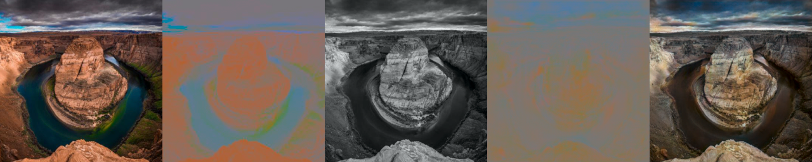
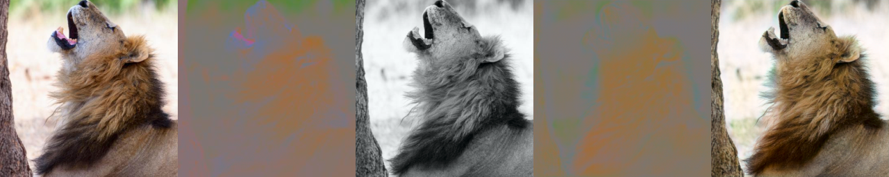
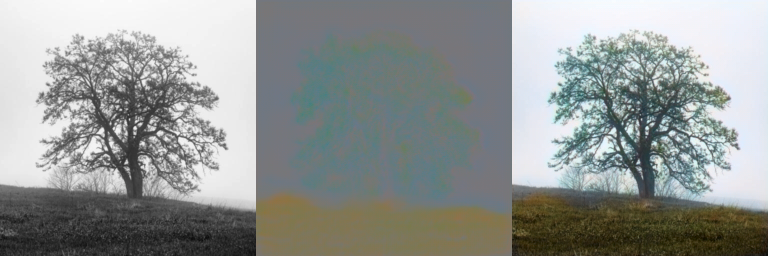
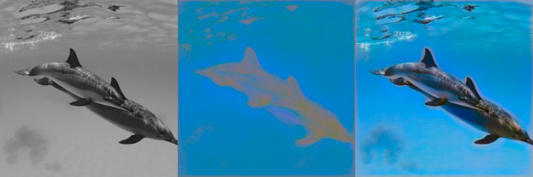
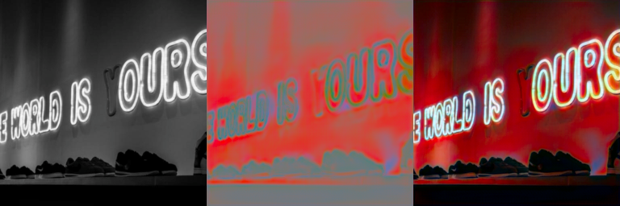
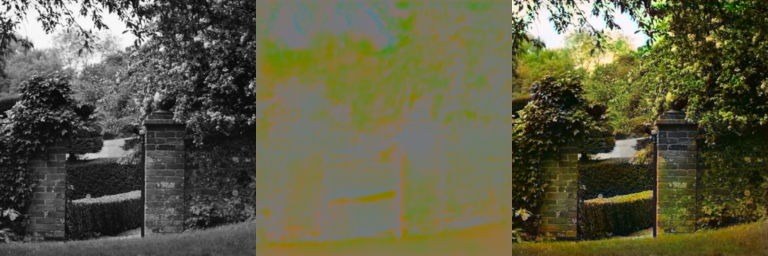

# pt-deep-image-colorization

PyTorch implementation of a deep neural network that utilizes a pre-trained VGG19 classification network together with a modified cascaded refinement network to (re-)colorize grayscale input images using only a small dataset of 10.000 images for training. The network operates on images in the LAB color space.
 
 Below you can find some examples from the validation (L+AB, AB, L, AB_fake, L+AB_fake) and the testing sets (L, AB_fake, L+AB_fake).
 

